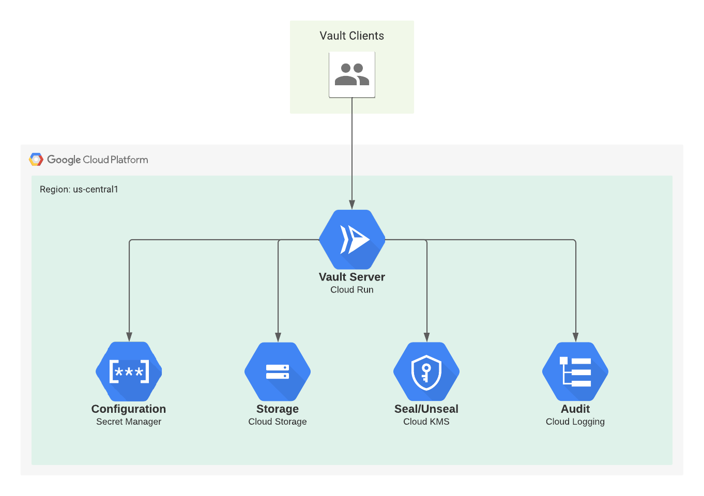

# serverless-vault-gcp

Serverless [HashiCorp Vault](https://www.vaultproject.io/) deployment on Google Cloud using Cloud Run, Cloud Storage, Cloud KMS, Secret Manager & Logging.



## Prequisites

* [Google Cloud](https://cloud.google.com/) project
* [gcloud](https://cloud.google.com/sdk/docs/install)
* [Docker](https://www.docker.com/products/docker-desktop)
* [Terraform](https://www.terraform.io/downloads)
* [Vault](https://www.vaultproject.io/downloads)

## Deployment

Set GCP Project Id environment variable.

```
PROJECT_ID=$(gcloud config get-value project)
```

### Push Vault Image to Container Registry

Enable `containerregistry.googleapis.com` API and push Vault image.

```
docker pull amd64/vault

docker tag amd64/vault gcr.io/${PROJECT_ID}/vault

docker push gcr.io/${PROJECT_ID}/vault
```

### Deploy Infrastructure

```
terraform apply
```

## Contributing

Pull requests are welcome. For major changes, please open an issue first to discuss what you would like to change.

Please make sure to update tests as appropriate.

## License

[MIT](https://choosealicense.com/licenses/mit/)